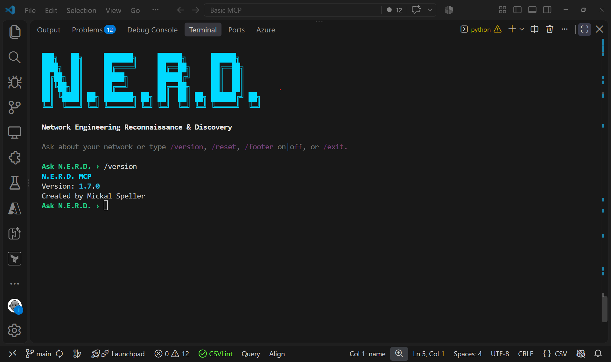
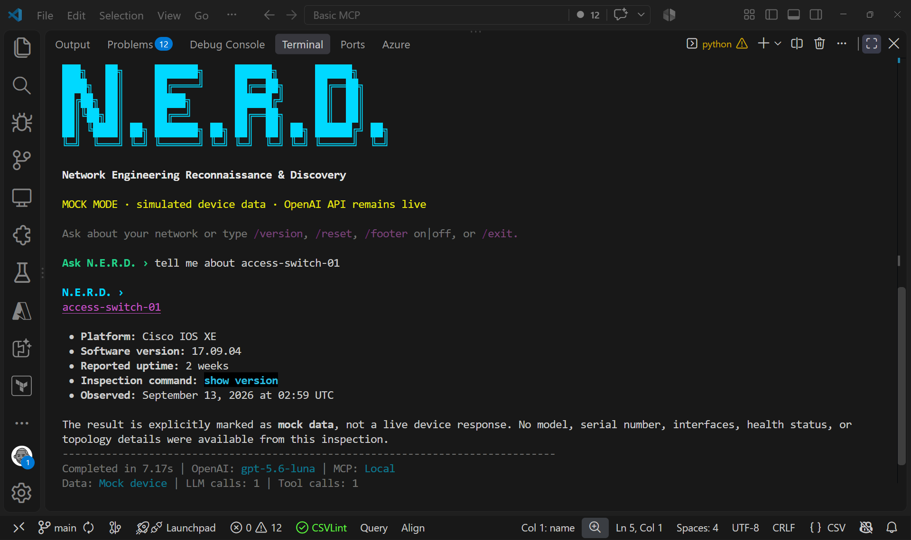

# NERD MCP

NERD (**Network Engineering Reconnaissance & Discovery**) is a local Python toolkit for inventory, read-only inspection, topology, health checks, configuration baselines, and natural-language analysis. It connects over SSH with Netmiko and exposes read-only Model Context Protocol (MCP) tools.






## Capabilities

- Import and search CSV or XLSX inventories stored in local SQLite.
- Inspect interfaces, VLANs, routes, neighbors, BGP, OSPF, VPN state, and configuration.
- Discover topology and MAC-address observations.
- Capture one baseline per device and compare current configuration.
- Use terminal chat through the OpenAI Responses API.
- Plan typed configuration changes with preview, approval, verification, rollback, and separate save approval.

| Platform | Inspection | Diagnosis | Configuration writes |
|---|---:|---:|---:|
| Cisco IOS / IOS-XE | Yes | Yes | Experimental, CLI opt-in |
| Cisco NX-OS | Yes | Yes | Read-only until validation |
| Aruba AOS-CX | Yes | Yes | Read-only until validation |
| Aruba AOS-Switch | Yes | Yes | Read-only until validation |
| Fortinet FortiOS | Yes | Yes | Read-only |

MCP is always read-only. Writes exist only in the local CLI, are disabled by default, and require `--enable-writes` plus exact approval phrases.

## Five-minute mock quick start

```powershell
git clone https://github.com/MickalSpeller/nerd-mcp.git
cd nerd-mcp
py -3.11 -m venv .venv
.\.venv\Scripts\Activate.ps1
python -m pip install -e ".[full]"
python -m nerd_mcp devices import .\devices.example.csv
python -m nerd_mcp devices list
python -m nerd_mcp inspect edge-router-01 get_device_info --mock
python -m nerd_mcp --version
```

Linux and macOS users activate with `source .venv/bin/activate`. Mock inspection needs no device, credentials, or OpenAI account.

```csv
name,host,port,credential_profile
edge-router-01,192.0.2.10,22,default
```

All examples are synthetic and use reserved documentation networks.

## Security and data handling

Credentials come from Windows Credential Manager or environment variables and never belong in inventory or SQLite. SSH host keys must be verified and enrolled. Terminal chat transmits relevant device output to the configured OpenAI API; use direct CLI or MCP inspection when output must remain local.

Start with [INSTALL.md](INSTALL.md). See [command examples](docs/COMMAND_EXAMPLES.md), [inventory](docs/INVENTORY.md), [CLI](docs/CLI.md), [MCP](docs/MCP.md), [controlled changes](docs/CONFIGURATION_CHANGES.md), [architecture](docs/ARCHITECTURE.md), and [troubleshooting](docs/TROUBLESHOOTING.md). Contributions and security reports are covered by [CONTRIBUTING.md](CONTRIBUTING.md) and [SECURITY.md](SECURITY.md).

Licensed under [Apache-2.0](LICENSE).
