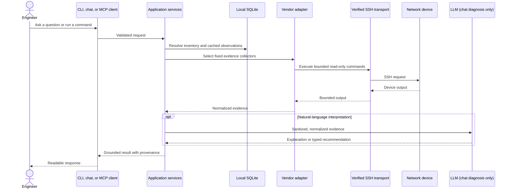
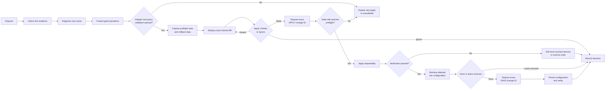

# NERD MCP architecture

NERD uses one shared application core for the terminal CLI, natural-language chat, and the local MCP server. The MCP boundary is read-only. Device configuration changes are available only through the local CLI after explicit write enablement and approval.

```mermaid
flowchart TB
    Engineer([Network engineer])
    LLMClient[Preferred LLM client<br/>with stdio MCP support]
    OpenAI[OpenAI Responses API]

    subgraph NERD[NERD MCP on the local workstation]
        direction TB

        subgraph Entry[User interfaces]
            CLI[Direct CLI commands]
            Chat[Natural-language terminal chat]
            MCP[Local stdio MCP server<br/>read-only tools]
        end

        subgraph Core[Application layer]
            Inventory[Inventory and search]
            Inspect[Inspection and health]
            Discovery[Topology, MAC, ARP,<br/>routes, and endpoints]
            Baselines[Configuration baselines<br/>and comparison]
            Diagnosis[Evidence-based diagnosis]
            Planner[Typed change planning]
            Writer[Controlled change execution<br/>CLI only]
        end

        subgraph Policy[Domain and safety controls]
            Models[Typed domain models]
            Capabilities[Platform capability matrix]
            Approval[Scoped, single-use approvals]
            Sanitizer[Validation, bounds,<br/>redaction, and output limits]
        end

        subgraph Data[Local persistence]
            SQLite[(SQLite database<br/>inventory, observations,<br/>baselines, and audit history)]
            Creds[(Credential source<br/>Windows Credential Manager<br/>or environment variables)]
            KnownHosts[(Verified SSH<br/>known-hosts file)]
        end

        subgraph Network[Device access]
            Vendors[Vendor adapters<br/>Cisco, Fortinet, and Aruba]
            SSH[Bounded Netmiko SSH transport<br/>timeouts, pooling, and cleanup]
        end
    end

    subgraph Devices[Managed network]
        IOS[Cisco IOS / IOS-XE]
        NXOS[Cisco NX-OS]
        FortiOS[Fortinet FortiOS]
        AOSCX[Aruba AOS-CX]
        AOSS[Aruba AOS-Switch]
    end

    Engineer --> CLI
    Engineer --> Chat
    Engineer --> LLMClient
    LLMClient <-->|JSON-RPC over stdio| MCP
    Chat <-->|Normalized evidence and response| OpenAI

    CLI --> Inventory
    CLI --> Inspect
    CLI --> Discovery
    CLI --> Baselines
    CLI --> Planner
    CLI -. explicit --enable-writes .-> Writer
    Chat --> Inventory
    Chat --> Inspect
    Chat --> Diagnosis
    Chat --> Planner
    MCP --> Inventory
    MCP --> Inspect
    MCP --> Discovery
    MCP --> Baselines

    Inventory --> SQLite
    Inspect --> Vendors
    Discovery --> Vendors
    Discovery --> SQLite
    Baselines --> SQLite
    Baselines --> Vendors
    Diagnosis --> Inspect
    Diagnosis --> Planner
    Planner --> Models
    Planner --> Capabilities
    Planner --> Vendors
    Planner --> SQLite
    Writer --> Approval
    Writer --> Capabilities
    Writer --> Sanitizer
    Writer --> Vendors
    Writer --> SQLite

    Vendors --> SSH
    SSH --> Creds
    SSH --> KnownHosts
    SSH --> IOS
    SSH --> NXOS
    SSH --> FortiOS
    SSH --> AOSCX
    SSH --> AOSS

    MCP -. no write path .-> ReadOnly[Write access blocked]

    classDef external fill:#253044,stroke:#7f8ea3,color:#ffffff;
    classDef interface fill:#003b4d,stroke:#00d7ff,color:#ffffff;
    classDef service fill:#263238,stroke:#ffd166,color:#ffffff;
    classDef safety fill:#402d20,stroke:#ffb347,color:#ffffff;
    classDef storage fill:#263b2c,stroke:#7ee787,color:#ffffff;
    classDef device fill:#3d2630,stroke:#ff7b72,color:#ffffff;

    class Engineer,LLMClient,OpenAI external;
    class CLI,Chat,MCP interface;
    class Inventory,Inspect,Discovery,Baselines,Diagnosis,Planner,Writer,Vendors,SSH service;
    class Models,Capabilities,Approval,Sanitizer,ReadOnly safety;
    class SQLite,Creds,KnownHosts storage;
    class IOS,NXOS,FortiOS,AOSCX,AOSS device;
```

## Read and diagnosis flow

## Controlled configuration flow

The LLM may interpret normalized evidence and propose typed operations. It cannot provide executable raw commands, authorize a change, access the write transport, or save configuration. Deterministic vendor adapters render commands and define verification and rollback behavior.

Credentials and API keys are never stored in the inventory database. Device output is bounded and sanitized before persistence or transmission to the configured LLM. Baselines and change records contain sanitized data and hashes rather than credentials or complete unsanitized configurations.
