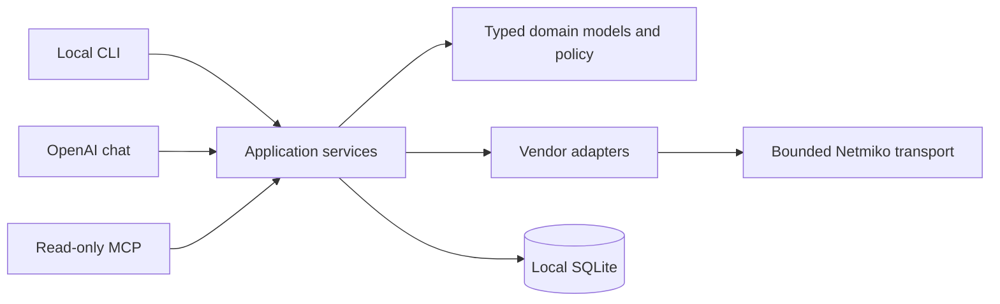

# Architecture

The terminal CLI and stdio MCP server share application services but enforce different capabilities.

Domain models define devices, evidence, diagnoses, baselines, and typed changes. Application services coordinate use cases. Storage adapters persist local state. Vendor adapters own commands and parsing. Transport owns verified SSH, timeouts, pooling, cleanup, and redaction. Compatibility facades preserve earlier public APIs.

The LLM interprets normalized evidence and can propose typed operations. It cannot emit executable raw CLI, authorize a change, call the write transport, or save configuration.
